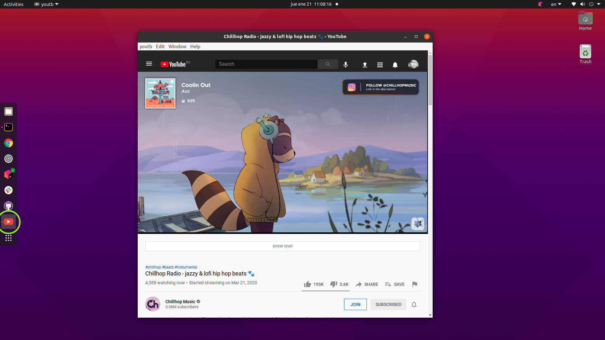
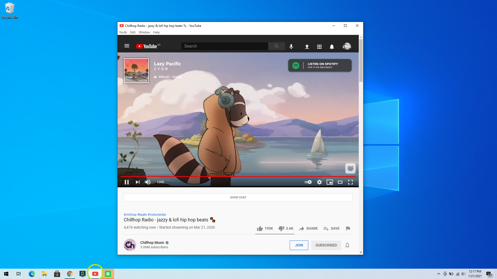

# &nbsp;Youtb Unofficial Youtube app


Running in MacOS

[](https://github.com/eriknyk/youtb/releases/latest)

Running in Ubuntu Linux

[](https://github.com/eriknyk/youtb/releases/latest)

Running in Windows

[](https://github.com/eriknyk/youtb/releases/latest)


---
*Requires OS X 10.8+ and Windows and Linux (*tested in ubuntu)

## Install

### Manually

[**Download**](https://github.com/eriknyk/youtb/releases/latest) the latest version for your platform. On OS X, unzip and move `youtb.app` to the `/Applications` directory.

On Linux, unzip to some location. To add a shortcut to the application, create a file in ``~/.local/share/applications`` called ``youtb.desktop`` with the following contents:

```
[Desktop Entry]
Name=youtb
Exec=/full/path/to/folder/Youtb
Terminal=false
Type=Application
Icon=/full/path/to/folder/icon.png

```

## Dev

Built with [Electron](http://electron.atom.io).

###### Commands

- Init: `$ npm install`
- Run: `$ npm start`
- Build: `$ npm run build`

## Known issues
- In live streamings, the chat section is not working, instead you will see a message like: `Oh no! It looks like you're using an older version of your browser. Please update it to use live chat.` I'm still investigating howto fix that, or feel free to contribute fixing it.

## License

MIT © [Erik Amaru Ortiz](http://github.com/eriknyk)
