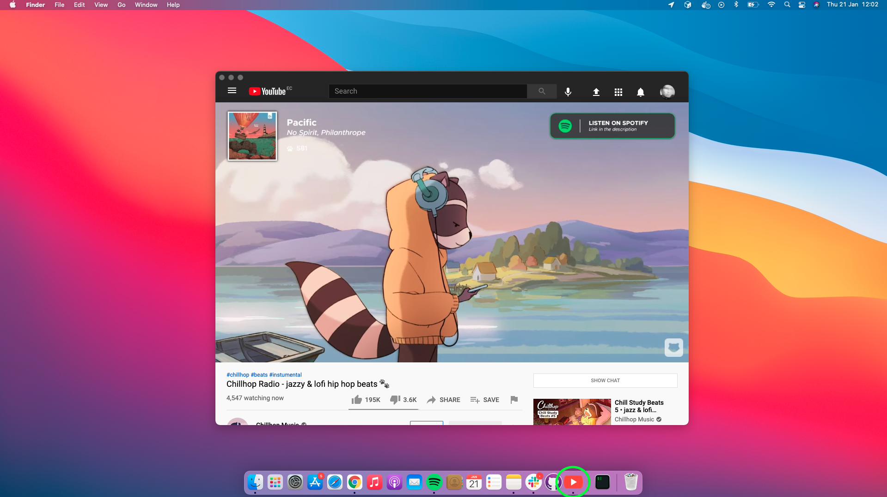

# &nbsp;Youtb Unofficial Youtube app

<br>
<div align="center">
<a href="https://github.com/sindresorhus/caprine/releases/latest">

</a>
</div>
<br>
<br>

---
*Requires OS X 10.8+ and Linux. Windows support planned.*

## Install

### Manually

[**Download**](https://github.com/eriknyk/youtb/releases/latest) the latest version for your platform. On OS X, unzip and move `youtb.app` to the `/Applications` directory.

On Linux, unzip to some location. To add a shortcut to the application, create a file in ``~/.local/share/applications`` called ``youtb.desktop`` with the following contents:

```
[Desktop Entry]
Name=youtb
Exec=/full/path/to/folder/youtb
Terminal=false
Type=Application
Icon=/full/path/to/folder/resources/app/media/Icon.png

```

## Dev

Built with [Electron](http://electron.atom.io).

###### Commands

- Init: `$ npm install`
- Run: `$ npm start`
- Build: `$ npm run build`


## License

MIT © [Erik Amaru Ortiz](http://github.com/eriknyk)
